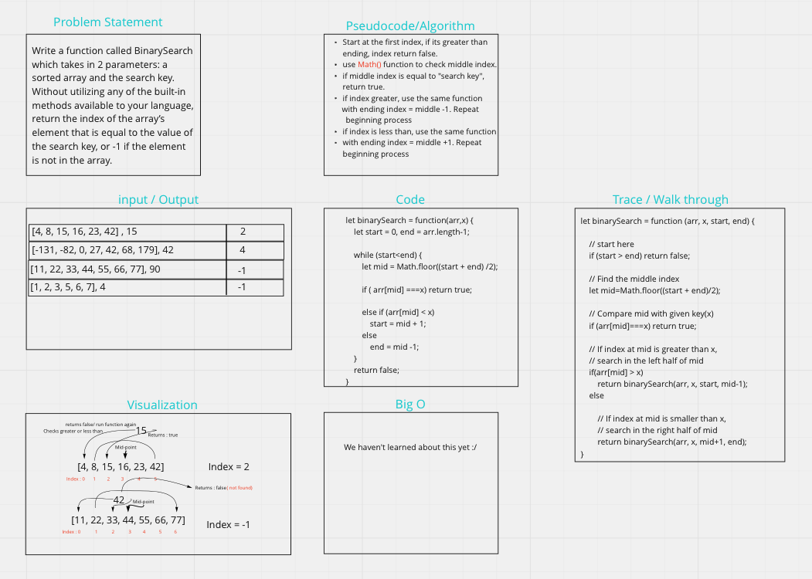

[Code challenge Class 03 link](https://miro.com/welcomeonboard/OHB3MXRreFE4S3dRVThsN081eVFuR01pbW9lR2JpeWFsTWc1UFR5V09JaUdlcm5hTkdpTTFoZUY1YXhsNXJPNnwzNDU4NzY0NTE4MDM5MzcyODMx?share_link_id=338250498445)

# Binary Search

I had to verbalize the process in which shows a key variable iterrating through an array each time searching to macth with equal number and if so returning the index of that number.

## Whiteboard Process



## Approach & Efficiency

I used the process we were shown in class. First having a high view of the question followed by what inputs I was given and what outputs were expected. Then created a visiualization of the funtionality, next the pseudocode followed by actual code. I used ```Math.floor``` beacause it allowed me to devide the array in half and then use arr.length to check if the value was greater or less than the key value. I then divied the array from that point to continue the process until number is found or if false, retun -1.

> references used:

- [link](https://www.geeksforgeeks.org/binary-search-in-javascript/)
