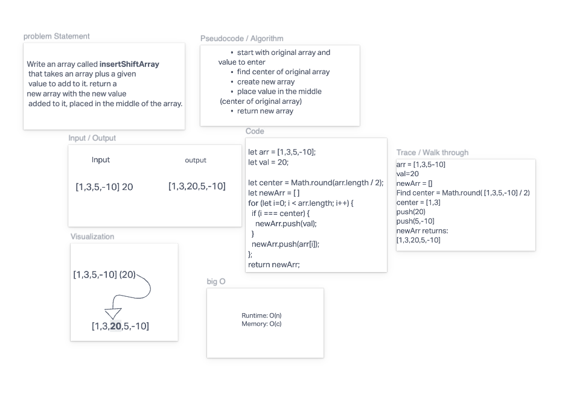

[Code challenge Class 02 link](https://dannycastro827593.invisionapp.com/freehand/Code-Challenge-02-9ryjXXIaE?dsid_h=244c4e30a6d6dd6599bc7fdcde7c5bc61d4946d33b00f483b256ff0cf4fb34f7&uid_h=61264989837f2b807804256dea4f072a9d61237003249c49acdb6ea1f097302e)

# Reverse an Array

I had to verbalize the process in which shows a variable being inserted to the center of an array. Afterwards retuning a new array.

## Whiteboard Process



## Approach & Efficiency

I used the process we were shown in class. First having a high view of the question followed by what inputs I was given and what outputs were expected. Then created a visiualization of the funtionality, next the pseudocode followed by actual code. I used ```Math.round``` beacouse it allowed me to devide the array in half and then round up to the center. Push is somewhat of a method but I wasn't totally sure and so I used that to insert the number into the array. Big O I believe is that if the array is odd, Math.round will get it as close to the center.
