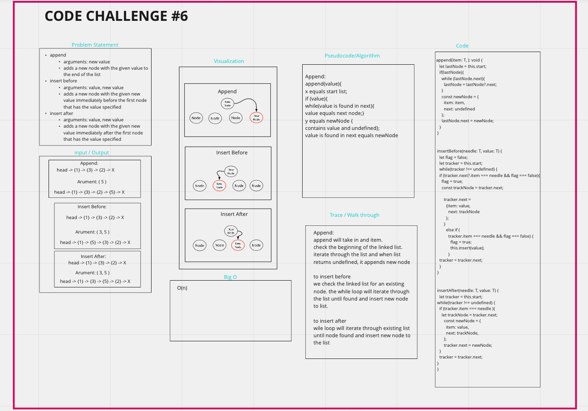

# Collection: Linked List

[Assignment instructions](https://codefellows.github.io/common_curriculum/data_structures_and_algorithms/Code_401/class-05/LAB)

## TypeScript Instructions

- Verify your types are correct with `npm run check`
- Verify your implementation is correct with `npm run test`
  - When converting the value in a node to a string, use the `display` function in [`Collection.ts`](./src/Collection.ts).
- DO NOT edit [assignment.test.ts](./src/).
- Add your own tests to [LinkedList.test.ts](./src/LinkedList.test.ts).
- Tests must pass the github workflow for full credit.

## TypeScript resources

- [Typescript Handbook](https://www.typescriptlang.org/docs/handbook/intro.html)

### Common Types

- `boolean` is `true` or `false`.
- `number` is any JavaScript number - `5`, `-17`, `22.356`, `3/10`, `Number.MAX_VALUE`, etc.
- `string` is any JavaScript string - `'hello'`, `'goodbye'`, `\`I am ${age}\``
- `interface Person { name: string; age: number; }` is a JavaScript object with two properties, `name` and `age`. `name` must be a string, and `age` must be a number.
- `(name: string, age: number) => Person` is a function with two parameters, `name` (a string) and `age` (a number), which will return an object of type `Person`.
- `() => void` is a function with no arguments, and returns nothing.
  <!-- - `'hello'`' is the JavaScript string `'hello'` and no other string. -->
  <!-- - `'hello'|'goodbye'` is either the JavaScript string `'hello'` or the string `'goodbye'`, and no other strings. -->

# Singly Linked List
<!-- Short summary or background information -->
```
We are moving and checking from one node to the next. if items are found continue. If not found return false and stop.
```
## Challenge
<!-- Description of the challenge -->

## Approach & Efficiency
<!-- What approach did you take? Why? What is the Big O space/time for this approach? -->
### Node

- Create a Node class that has properties for the value stored in the Node, and a pointer to the next Node.

### Linked List

- Create a Linked List class

- Within your Linked List class, include a head property.
  - Upon instantiation, an empty Linked List should be created.
- The class should contain the following methods
  - insert
    - Arguments: value
    - Returns: nothing
    - Adds a new node with that value to the ```head``` of the list with an O(1) Time performance.
  - includes
    - Arguments: value
    - Returns: Boolean
      - Indicates whether that value exists as a Node’s value somewhere within the list.
  - to string
    - Arguments: none
    - Returns: a string representing all the values in the Linked List, formatted as:
    - ```{ a } -> { b } -> { c } -> NULL```

> # Code Challenge 06

## Whiteboard Process



## Approach & Efficiency

I iterate through each node.

## Solution

 > ### Append:

- append will take in and item.
check the beginning of the linked list.
iterate through the list and when list returns undefined, it appends new node

> ### Insert before

- we check the linked list for an existing node. the while loop will iterate through the list until found and insert new node to list.

> ### Insert after

- wile loop will iterate through existing list until node found and insert new node to the list

> # Code Challenge 07

## Whiteboard Process


## Approach & Efficiency

I check the beggining of the list and iterate throw the nodes in the list adding them as it goes. If the number we look for is over or under the list quantaty I throw an error.

## Solution
